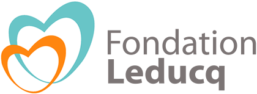

# EndoMT in the Athero-Express.

*Athero-Express Team*

Lotte Slenders, 
Marian Wesseling, 
Sander W. van der Laan, 
Michal Mokry, 
Dominique de Kleijn,
Gert Jan de Borst.

**Project ID** [`EndoMT_in_AE`]

## Background

Here we study endoMT in carotid plaques from the Athero-Express.

## Study design

<!-- Please add a brief introduction to explain what the project is about    -->

## Where do I start?

You can load this project in RStudio by opening the file called 'EndoMT_in_AE.Rproj'.

## Project structure

<!--  You can add rows to this table, using "|" to separate columns.         -->
File                       | Description                         | Usage         
---------------------------| ----------------------------------- | --------------
README.md                  | Description of project              | Human editable
EndoMT_in_AE.Rproj         | Project file                        | Loads project 
LICENSE                    | User permissions                    | Read only     
.worcs                     | WORCS metadata YAML                 | Read only     
renv.lock                  | Reproducible R environment          | Read only     
images                     | image directory for project         | Human editable
scripts                    | Scripts directory                   | Human editable

<!--  You can consider adding the following to this file:                    -->
<!--  * A citation reference for your project                                -->
<!--  * Contact information for questions/comments                           -->
<!--  * How people can offer to contribute to the project                    -->
<!--  * A contributor code of conduct, https://www.contributor-covenant.org/ -->

# Reproducibility

This project uses the Workflow for Open Reproducible Code in Science (WORCS) to
ensure transparency and reproducibility. The workflow is designed to meet the
principles of Open Science throughout a research project. 

To learn how WORCS helps researchers meet the TOP-guidelines and FAIR principles,
read the preprint at https://osf.io/zcvbs/

## WORCS: Advice for authors

* To get started with `worcs`, see the [setup vignette](https://cjvanlissa.github.io/worcs/articles/setup.html)
* For detailed information about the steps of the WORCS workflow, see the [workflow vignette](https://cjvanlissa.github.io/worcs/articles/workflow.html)

## WORCS: Advice for readers

Please refer to the vignette on [reproducing a WORCS project]() for step by step advice.
<!-- If your project deviates from the steps outlined in the vignette on     -->
<!-- reproducing a WORCS project, please provide your own advice for         -->
<!-- readers here.                                                           -->

# Acknowledgements

Dr. Sander W. van der Laan is funded through grants from the Netherlands CardioVascular Research Initiative of the Netherlands Heart Foundation (CVON 2011/B019 and CVON 2017-20: Generating the best evidence-based pharmaceutical targets for atherosclerosis [GENIUS I&II]). We are thankful for the support of the ERA-CVD program ‘druggable-MI-targets’ (grant number: 01KL1802), the EU H2020 TO_AITION (grant number: 848146), and the Leducq Fondation ‘PlaqOmics’.

Plaque samples are derived from carotid endarterectomies as part of the [Athero-Express Biobank Study](https://doi.org/10.1007/s10564-004-2304-6) which is an ongoing study in the UMC Utrecht.

The framework was based on the [`WORCS` package](https://osf.io/zcvbs/).

    

#### Changes log
    
    _Version:_      v1.0.0 
    _Last update:_  2022-11-08 
    _Written by:_   Lotte Slenders; Sander W. van der Laan (s.w.vanderlaan-2[at]umcutrecht.nl).
    
    **MoSCoW To-Do List**
    The things we Must, Should, Could, and Would have given the time we have.
    _M_

    _S_

    _C_

    _W_

    **Changes log**
    * v1.0.0 Initial version. 

--------------

#### Creative Commons BY-NC-ND 4.0
##### Copyright (c) 1979-2022 Lotte Slenders | Sander W. van der Laan | s.w.vanderlaan [at] gmail [dot] com.

This is a human-readable summary of (and not a substitute for) the [license](LICENSE). 
 
You are free to share, copy and redistribute the material in any medium or format. The licencor cannot revoke these freedoms as long as you follow the license terms. 
 
Under the following terms:  
<em>- Attribution</em> — You must give appropriate credit, provide a link to the license, and indicate if changes were made. You may do so in any reasonable manner, but not in any way that suggests the licensor endorses you or your use. 
<em>- NonCommercial</em> — You may not use the material for commercial purposes. 
<em>- NoDerivatives</em> — If you remix, transform, or build upon the material, you may not distribute the modified material. 
<em>- No additional</em> restrictions — You may not apply legal terms or technological measures that legally restrict others from doing anything the license permits. 
 
Notices:  
You do not have to comply with the license for elements of the material in the public domain or where your use is permitted by an applicable exception or limitation.
No warranties are given. The license may not give you all of the permissions necessary for your intended use. For example, other rights such as publicity, privacy, or moral rights may limit how you use the material.

